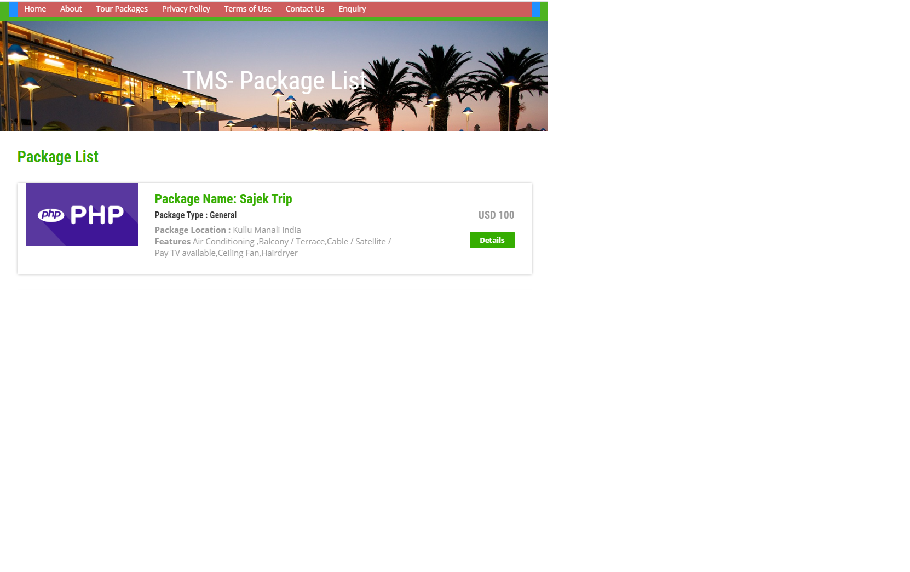
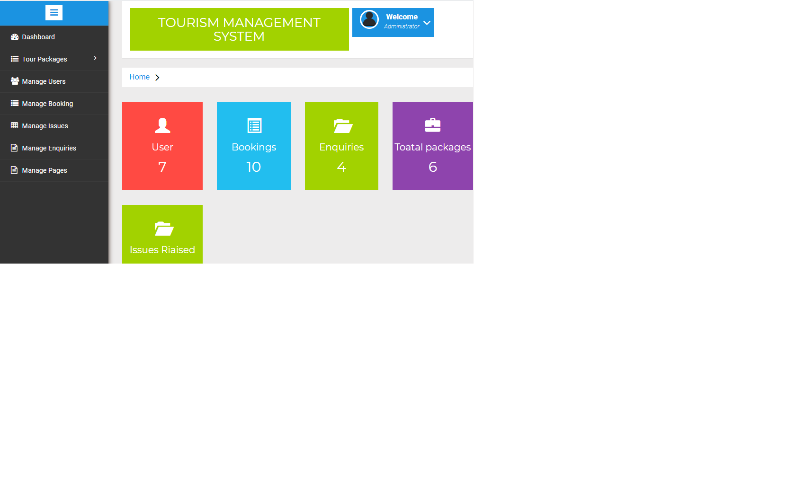
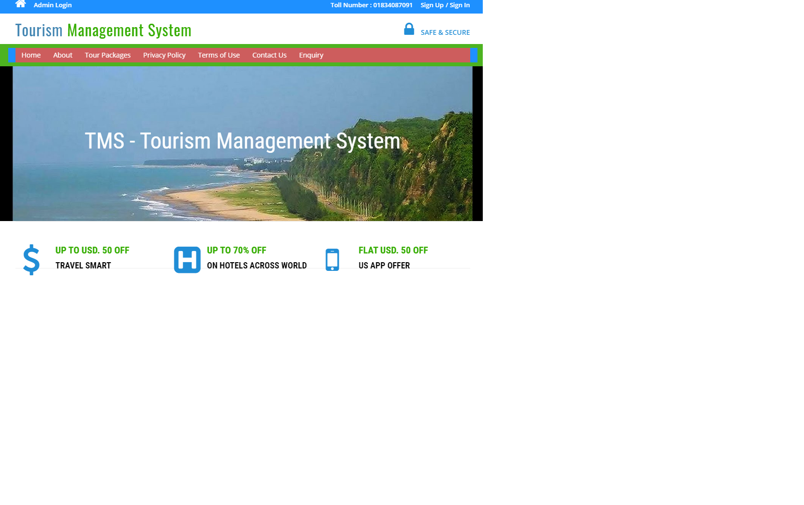

# Tour-Management-System
Language Used:  PHP

Database:  My SQL

User Interface Design:  HTML, AJAX,JQUERY,JAVASCRIPT

Web Browser:  Mozilla, Google Chrome, IE8,OPERA

Software:    XAMPP Server

User can register yourself.
User can login with valid email and password.
Forgot Password(user Can recover own password)
Tour Booking
Manage Booking
Generate Ticket(Regarding Complaint)
change Password

Admin can create Package
Manage packages(Create,Update)
Manage Users
Manage Inquiries
Manage issues
Manage Booking
Manage Pages
Change Password
Admin Dashboard

Username : admin
Password : Test@123||

